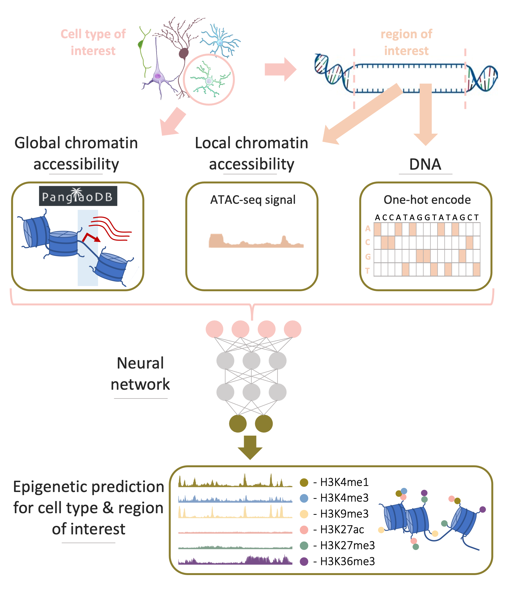

# Enformer Celltyping

[](./EnformerCelltyping.png)

Enformer Celltyping is a tensorflow, multi-headed attention based model that
incorporates distal effects of Deoxyribonucleic Acid (DNA) interactions to 
predict histone marks across diverse cell types.

Enformer Celltyping uses DNA and chromatin accessibility information (derived 
from ATAC-Seq experiments) to predict histone mark signals (H3k27ac, H3k4me1,
H3k4me3, H3k9me3, H3k27me3, H3k36me3).

The prediction of histone marks, transcription factors and gene expression from
DNA was progressed by [Enformer](https://www.nature.com/articles/s41592-021-01252-x).
A multi-headed attention model which can consdier long-range DNA interactions
(up to ~100k base-pairs away). However, a key limitation is that Enformer can
only predict on the cell types upon which it was trained and thus is primarily 
useful for interpretation of its output, for example _in silico_ saturated
mutagenesis of DNA sequence. Here, we extend these long-range capabilities 
through a transfer learning approach but also enable the prediction 
in cell types outside of the training set by incorporating chromatin acessibility
information.


## Installation

First, clone this repository and move to the directory.

```
git clone https://github.com/neurogenomics/EnformerCelltyping && cd EnformerCelltyping
```

To use Enformer Celltpying, dealing with it's dependencies, you should install 
[conda](https://docs.conda.io/en/latest/) package manager.

Once `conda` is installed, place the `conda` executable in `PATH`, use the following 
command to create an environment named EnformerCelltyping with all necessary 
dependencies and activate it. **Note** this may take some time to complete:

Create the necessary environments using the yml files, then activate the 
Enformer Celltyping environment:

```
conda env create -f ./environment/enformer_celltyping.yml &&\
make renv &&\ 
make pyanalyenv &&\
conda activate EnformerCelltyping &&\
pip install -e .
```

Next all use-cases for Enformer Celltyping involve transfer learning from the enformer 
model (with frozen weights) and require some other files to run. Also, if you want to use
the trained version of Enformer Celltyping, the weights will need to be downloaded. So 
download these with the following with the `EnformerCelltyping` conda env activated:

```
python bin/download_Enformer_Celltyping_dependencies.py
```

See [using_enformer_celltyping](https://github.com/neurogenomics/EnformerCelltyping/blob/master/using_enformer_celltyping.ipynb)
for a detailed explanation of all of these files. Downloaded data can also be viewed at source
on [figshare](https://figshare.com/projects/Enformer_Celltyping/159143).

## Enformer Celltyping - how can it be used for research?

Enformer Celltyping has two main usage categories:
  1. You want to use the trained Enformer Celltyping model to predict. For example,
     you may have ATAC-seq (bulk or scATAC-seq which you have pseudobulked) for
     a cell type/tissue of interest and you would like to predict histone mark 
     tracks for it. See `Using & interpretting Enformer Celltyping` section below for this 
     and other uses for the trained Enformer Celltyping model.
  2. You are interested in training an Enformer Celltyping model on your own data
     so would like to see the trianing process. See `Training Enformer Celltyping`.
    
    
## Training Enformer Celltyping

To understand how to train Enformer Celltyping on your own data, see 
[training_demo.ipynb](https://github.com/neurogenomics/EnformerCelltyping/blob/master/training_demo.ipynb) 
which steps through training the model on demo data. Or see 
[full_training_recreation.ipynb](https://github.com/neurogenomics/EnformerCelltyping/blob/master/full_training_recreation.ipynb) for the full set of scripts to download, preprocess and
train Enformer Celltyping as outlined in our manuscript.


## Using & interpretting Enformer Celltyping    

To see all use cases for the pre-trained Enformer Celltyping model, see
[using_enformer_celltyping](https://github.com/neurogenomics/EnformerCelltyping/blob/master/using_enformer_celltyping.ipynb).
The use cases included are:
  * Predict histone marks for a cell type of interest.
  * Testing the receptive field of a model.
  * Visualise Enformer Celltyping's cell type embedding.
  * Predict the effect of a genetic variant.


## Reproducing hQTL SNP effect prediction analysis

Reproducing the hQTL SNP effect predicition analysis from our paper includes predicting 
the effect of a genetic variants as explained in [using_enformer_celltyping](https://github.com/neurogenomics/EnformerCelltyping/blob/master/using_enformer_celltyping.ipynb). 
However, since this requires predicting the effect for **>850k SNPs for every cell type of interest**, 
we used code to checkpoint partial runs in case of any errors, precomputed DNA embeddings for all SNPs 
and set up runs in parallel. The analysis also required preprocessing of the hQTL datasets. See [reproducing_hQTL_SNP_effect_prediction](https://github.com/neurogenomics/EnformerCelltyping/blob/master/reproducing_hQTL_SNP_effect_prediction.ipynb) 
for details and related scripts.


